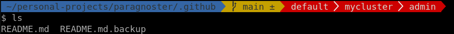

# Paragnoster
This is a fork of agnoster theme from [oh my zsh](https://github.com/ohmyzsh/ohmyzsh).

This new version of **agnoster** theme supports also Openshift info(i.e.: project/namespace, cluster simple name, user).

You can configure how your cluster name can be mapped to a different *(shorter)* name. To do this, modify your .zshrc file, in this way:
after the line with `source $ZSH/oh-my-zsh.sh` write a mapping for every pattern you want to customize, e.g.:
```
kubectx_mapping[-crc-]='-(crc)-'
kubectx_mapping[api-*-openshift]='api-(.*)-openshift
```

On the left use a simple pattern, on the right use a regex with a capturing group, which is the final name showed for your cluster.
Both pattern and regex need to match just a substring of the whole cluster name.
The first line of the above example turn your crc cluster name to just "crc".
The second line of the above example turn a cluster name, let's say, "api-mycluster-openshift", just to "mycluster".

Last thing to say: i added a new line to the prompt, you can see also this from the following image. 



---

## License
Paragnoster is released under the [MIT license](https://github.com/vitorz/paragnoster/blob/master/.github/LICENSE.txt).
